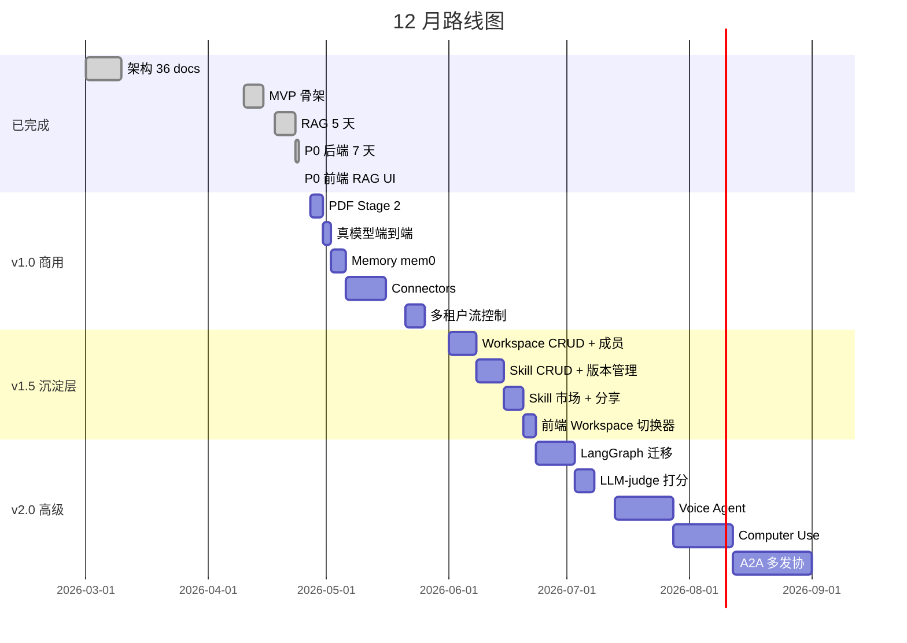

# Custom Agent · 企业级 Agent 平台

---

## 一图懂全貌

```
┌────────────────────────────────────────────────────────┐
│  员工进入【风控分析】Workspace, 选用【月报生成】Skill   │
│  问: "Q3 华东大客户违约率多少？参考哪份报告？"          │
└────────────────────────┬───────────────────────────────┘
                         ▼
        ┌────────────────────────────────────┐
        │   Custom Agent 平台                 │
        │   ┌──────┐  ┌──────┐  ┌──────┐    │
        │   │ RAG  │  │工具  │  │多模型│    │
        │   │+ ACL │  │ MCP  │  │ 路由 │    │
        │   └──────┘  └──────┘  └──────┘    │
        │      ↓        ↓         ↓          │
        │   只看本     调允许      自动选     │
        │   workspace  的工具      便宜模型   │
        └────────────────────────┬───────────┘
                         ▼
┌────────────────────────────────────────────────────────┐
│  答: "Q3 违约率 1.8%，源自《风控月报》第 12 页 [doc]"  │
│  → 引用可点开溯源 · 成本 $0.0007 · 全链路可审计        │
└────────────────────────────────────────────────────────┘
```

**一句话**：以 **Workspace** 为单元、**Skill** 为复用，把企业的文档 + 工具变成一个**带引用、可审计、成本可控**的 Agent。

---

## 一. 解决什么问题

```
① 文档散落 (Confluence/SharePoint/飞书/Git) — 员工找不到历史决策
② 客服/HR/IT 每天答 100 遍重复问题 — 专家经验沉淀不下来
③ 通用 ChatGPT 不懂业务，瞎编 — SaaS 不能碰敏感数据
④ 自己用 LangChain 拼 — 多租户/ACL/成本/合规 半年写不完
```

---

## 二. 平台沉淀（核心架构）

### 2.1 业务沉淀（用户视角）

```
        Tenant (公司)
           │
           ├──── Workspace (项目/团队) ★ 隔离单元
           │       │   ├─ default_model      默认模型
           │       │   ├─ allowed_tools      工具白名单
           │       │   ├─ allowed_collections KB 范围
           │       │   ├─ budget_caps        成本上限
           │       │   └─ members[]          成员
           │       │
           │       ├──── Skill (复用配方) ★ 经验沉淀
           │       │       ├─ system_prompt    定制 system 提示
           │       │       ├─ allowed_tools    子集工具
           │       │       ├─ default_collections
           │       │       └─ starter_examples
           │       │
           │       ├──── Collection (KB 命名空间)
           │       │       └── Documents → Chunks
           │       │
           │       └──── Session (一次对话)
           │
           └──── Workspace (另一个项目，互不可见)
```

| 层 | 干啥 | 例子 | 状态 |
|---|---|---|---|
| **Tenant** | 公司账号、计费主体 | "ABC 银行" | ✅ 已有 |
| **Workspace** ⭐ | 项目隔离：各自一套 KB / 工具 / 预算 / 成员 | "风控分析"、"客服中心" | 🟨 v1.0 隐式默认 → **v1.5 完整** |
| **Skill** ⭐ | 复用"配方"：prompt + 工具白名单 + KB 选择 | "月报生成"、"合同审查" | 🟨 **v1.5** |
| **Collection** | KB 命名空间 | "legal-docs"、"product-wiki" | ✅ 已有 |
| **Session** | 一次对话 | 1 用户 1 话题 | ✅ 已有 |

### 2.2 技术沉淀（工程视角）

```
┌─────────────────────────────────────────────────────────┐
│   接入层 (FastAPI + SSE 流式)                            │
│   鉴权: API Key → Principal (tenant + actor + ACL)       │
└─────────────────────┬───────────────────────────────────┘
                      ▼
┌─────────────────────────────────────────────────────────┐
│   Agent Runtime  (ReAct 循环 + 5 道 Guardrail)           │
│   计划 → 执行 → 观察 → 反思 → 完成                        │
└──┬───────────┬───────────┬───────────┬──────────────────┘
   ▼           ▼           ▼           ▼
┌───────┐ ┌─────────┐ ┌──────────┐ ┌──────────────┐
│ LLM   │ │ RAG     │ │ Tool     │ │ Memory       │
│Gateway│ │ Core    │ │ 系统     │ │ (mem0)       │
│       │ │         │ │          │ │              │
│LiteLLM│ │切分父子 │ │MCP 协议  │ │短期 + 长期   │
│Router │ │三路召回 │ │stdio 子进│ │用户偏好      │
│cache  │ │bge 重排 │ │程        │ │              │
│       │ │语义缓存 │ │4 servers │ │              │
└───┬───┘ └────┬────┘ └────┬─────┘ └──────┬───────┘
    │          │           │              │
    │      ┌───┴────┐   ┌──┴──┐    ★ v2.0 │
    │      │PaddleOCR│  │time │           │
    │      │PDF Stage│  │calc │           │
    │      │  2      │  │web  │           │
    │      └────────┘   │rag  │           │
    │      ★ v1.0 末    └─────┘           │
    │                                     │
    └──┬──────┬──────┬──────────┬─────────┘
       ▼      ▼      ▼          ▼
┌─────────────────────────────────────────────────────────┐
│   存储层  Postgres + pgvector (HNSW) + Redis             │
│   8 张表: rag_docs/chunks/cache · chat_sessions/messages │
│           api_keys · ingest_jobs · rag_eval_badcases     │
└─────────────────────────────────────────────────────────┘
                                    ★ v1.5 加 workspaces / skills
─────────────────────────────────────────────────────────
横切关注:
┌─────────────────────────────────────────────────────────┐
│ 安全: per-call JWT (HS256, 60s) + ACL 三重锁              │
│       schema 剥字段 / Executor 覆盖注入 / MCP 验签         │
├─────────────────────────────────────────────────────────┤
│ 观测: Langfuse trace · 每请求 trace_id 可审计              │
│       Prometheus 6 条告警规则 (蓝图)                      │
├─────────────────────────────────────────────────────────┤
│ 评测: 55 QA · 4 模式 A/B · CI --strict 阈值卡 PR          │
├─────────────────────────────────────────────────────────┤
│ 合规: License Scan (CI 卡 AGPL) · Sandbox (MinerU 隔离)   │
└─────────────────────────────────────────────────────────┘
```

| 技术层 | 干啥 | 关键技术 | 状态 |
|---|---|---|---|
| **接入** | API 入口、流式、鉴权 | FastAPI + SSE + API Key→Principal | ✅ |
| **Agent Runtime** | 推理循环、护栏 | 自研 ReAct + Planner/Executor + 5 Guardrail | ✅ |
| **LLM Gateway** | 多厂商接入、路由、缓存 | LiteLLM (100+ 厂商) + ModelRouter (6 决策) | ✅ |
| **RAG Core** | 解析/切分/召回/重排 | pypdfium + jieba + bge-reranker + RRF + pgvector | ✅ |
| **Tool 系统** | 标准化工具协议 | MCP (stdio 子进程) + 4 servers | ✅ |
| **Memory** | 短期 + 长期记忆 | mem0 / Letta | 🟨 v2.0 |
| **存储** | 持久化 + 向量 + 队列 | Postgres + pgvector (HNSW) + Redis | ✅ |
| **安全** | 多租户隔离、ACL | JWT 三重锁 + SQL `tenant_id` 强制 | ✅ |
| **观测** | trace + 指标 + 告警 | Langfuse + Prometheus 蓝图 | ✅ partial |
| **评测** | 质量回归、CI 卡口 | 55 QA × 4 模式 + `--strict` | ✅ |
| **沉淀层** | Workspace + Skill | 7 张新表 + 12 endpoints | 🟨 **v1.5** |
| **前端** | Console + SDK | Next.js + Python/TS SDK + react-markdown | ✅ |

### 2.3 业务 ↔ 技术 映射

| 业务对象 | 技术实现 |
|---|---|
| Tenant | `api_keys` 表 + `Principal.tenant_id` 字段（每条 SQL 强制过滤） |
| Workspace ⭐ | `workspaces` 表（v1.5）+ 配额 / 工具白名单 / 成员表 |
| Skill ⭐ | `skills` 表（v1.5）+ 版本管理 + 跨 workspace 分享 |
| Collection | `rag_docs.collection` 列 + HNSW 复合索引 |
| Session | `chat_sessions` + `chat_messages` 双表 + 异步标题生成 |
| Doc + Chunk | `rag_docs / rag_chunks / rag_doc_versions` + 父子关联 |
| 一次工具调用 | `tool_calls` JSONB + retrieval.start/done SSE 事件 |

---

## 三. 五块组成

```
┌─────────────────────────────────────────────────┐
│      Workspace 容器 ★ v1.5                      │
│                                                  │
│   ┌────────────────────────────────────────┐    │
│   │  Skill (配方) ★ v1.5                    │    │
│   └────────────────┬───────────────────────┘    │
│                    ▼                            │
│            ┌───────────────┐                    │
│            │  Agent Runtime │  (✅ 已交付)      │
│            │  ReAct + 5     │                   │
│            │  Guardrail     │                   │
│            └──┬──────────┬──┘                   │
│       ┌───────┘          └───────┐              │
│       ▼                          ▼              │
│   ┌────────┐                ┌────────┐         │
│   │  KB    │  (✅ 已交付)   │ 工具    │ (✅ 已交付)│
│   │ RAG +  │                │ MCP    │         │
│   │ ACL    │                │ 协议   │         │
│   └────────┘                └────────┘         │
└─────────────────────────────────────────────────┘
              ★ = 设计就绪, 实现在 v1.5
```

---

## 四. 现在做完啥（v1.0 已交付）

| 模块 | 要点 |
|---|---|
| Agent Runtime | ReAct 循环 + 5 道 Guardrail（成本/token/死循环/工具失败/步数）+ SSE 流式 |
| 多模型 LLM | 100+ 厂商接入，**ModelRouter 自动按问题复杂度选 cheap/smart 模型** |
| 工具系统 | MCP 标准协议，已接 4 个：time / calc / web-search / **search_kb** |
| RAG 检索 | 父子分级切分 + 三路混合召回（Dense+BM25+RRF）+ bge 重排 + 拒答阈值 + 语义缓存 |
| **ACL 三重锁** | per-call JWT 注入，LLM 永远看不到 token，prompt injection 无法越权 |
| 数据持久化 | Chat 历史、KB 文档、引用全入 PG；trace_id 进 Langfuse 可审计 |
| 前端 Console | 聊天 + KB 上传/列表 + 引用气泡 + Markdown 渲染 + 状态徽章 |
| 合规护栏 | CI 扫 AGPL 自动红灯（彻底回避 PyMuPDF / MinerU 商用毒丸） |
| 评测体系 | 55 条 QA + 4 模式 A/B + `--strict` 阈值卡 PR |

---

## 五. 未来规划

### v1.5 沉淀层（2026-06，6-7 月）

**为什么**：现在所有用户共享一个隐式默认 workspace，多个项目混在一起；技能（"月报生成"这种复用场景）每次重写 prompt。**Workspace + Skill 是企业用起来的关键沉淀。**

- **Workspace CRUD**（7 天）：建 / 配 / 加成员 / 切换
- **Skill CRUD + 版本**（7 天）：建配方 / 发版本 / 共享
- **Skill 市场**（5 天）：跨 workspace 分享、订阅
- **前端 Workspace 切换器**（3 天）：sidebar 顶部下拉

### v2.0 高级能力（2026-07~08）

| 能力 | 干啥 |
|---|---|
| LangGraph 迁移 | 复杂工作流编排 |
| LLM-as-judge | 自动算 faithfulness，bad-case 闭环不靠人工点踩 |
| Voice Agent | 语音端到端 < 2s |
| Computer Use | 操控浏览器/桌面 |
| A2A 协作 | 多 agent 编排 |

### v3.0 国产化（2026-12）

- 端侧推理 / 信创栈完整验证 / 私有大模型完全替换 DeepSeek/Anthropic

### 路线图

![diagram](https://mermaid.ink/img/Z2FudHQKICAgIHRpdGxlIDEyIOaciOi3r-e6v-WbvgogICAgZGF0ZUZvcm1hdCBZWVlZLU1NLURECiAgICBzZWN0aW9uIOW3suWujOaIkAogICAgIOacuOaehOiuvuiuoSAzNiBkb2NzICAgIDpkb25lLCAyMDI2LTAzLTAxLCAyMDI2LTAzLTEwCiAgICAgTVZQIOmqqOaehiAgICAgICAgICAgIDpkb25lLCAyMDI2LTA0LTEwLCAyMDI2LTA0LTE1CiAgICAgUkFHIDUg5aSpICAgICAgICAgICAgIDpkb25lLCAyMDI2LTA0LTE4LCAyMDI2LTA0LTIzCiAgICAgUDAg5ZCO56uvIDcg5aSpICAgICAgIDpkb25lLCAyMDI2LTA0LTIzLCAyMDI2LTA0LTI0CiAgICAgUDAg5YmN56uvIFJBRyBVSSAgICA6ZG9uZSwgMjAyNi0wNC0yNCwgMjAyNi0wNC0yNAogICAgc2VjdGlvbiB2MS4wIOWVhueUqAogICAgIFBERiBTdGFnZSAyICAgICAgICAgICA6MjAyNi0wNC0yNywgM2QKICAgICDnnJ_mqKHlnovnq6_liLDnq6_liLAgICAgICAgIDoyMDI2LTA0LTMwLCAyZAogICAgIE1lbW9yeSBtZW0wICAgICAgICAgIDoyMDI2LTA1LTAyLCA0ZAogICAgIENvbm5lY3RvcnMg44KKICAgICAgICAgICAgOjIwMjYtMDUtMDYsIDEwZAogICAgIPCfm6Ag5aSa56ef5oi35rWB5o6n5Yi2ICA6MjAyNi0wNS0yMSwgNWQKICAgICBzZWN0aW9uIHYxLjUg5rKJ5reA5bGCCiAgICAgV29ya3NwYWNlIENSVUQgKyDmiJDlkZggICAgOjIwMjYtMDYtMDEsIDdkCiAgICAgU2tpbGwgQ1JVRCArIOeJiOacrOeuoeeQhiAgOjIwMjYtMDYtMDgsIDdkCiAgICAgU2tpbGwg5biC5Zy6ICsg5YiG5LqrICAgICA6MjAyNi0wNi0xNSwgNWQKICAgICDliY3nq68gV29ya3NwYWNlIOWIh-aNouWZqCA6MjAyNi0wNi0yMCwgM2QKICAgIHNlY3Rpb24gdjIuMCDpq5jlvoEKICAgICBMYW5nR3JhcGgg6L-B5Yi3ICAgOjIwMjYtMDYtMjMsIDEwZAogICAgIExMTS1qdWRnZSDmiZPliIYgICAgOjIwMjYtMDctMDMsIDVkCiAgICAgVm9pY2UgQWdlbnQgICAgICAgOjIwMjYtMDctMTMsIDE1ZAogICAgIENvbXB1dGVyIFVzZSAgICAgOjIwMjYtMDctMjgsIDE1ZAogICAgIEEyQSDlpJrlj5HkvqYgICAgICAgIDoyMDI2LTA4LTEyLCAyMGQ?type=png)

<details><summary>📐 mermaid 源码</summary>



</details>

### 关键里程碑

| 时间 | 节点 | 验收 |
|---|---|---|
| **2026-05-15** | v1.0 商用 beta | 5 家试点跑通 |
| **2026-06-30** | **v1.5 沉淀层** | 一个 tenant 至少 3 workspace 实测 |
| 2026-08-01 | v2.0 Voice + 协作 | 语音 e2e < 2s |
| 2026-12-01 | v3.0 国产化 | 信创栈完整验证 |

---

## 六. 路上的坑

| 风险 | 缓解 |
|---|---|
| RAG 准确率不够 | CI 评测卡口 + 周漂移告警 + bad-case 周会 |
| 跨租户数据泄露 | JWT per-call + SQL ACL **双闸** |
| AGPL 法律风险 | CI 自动扫 + 沙箱隔离（MinerU/PyMuPDF 永不进生产） |
| 大模型成本失控 | ModelRouter 路由 + 语义缓存 + skill 级 budget |
| Workspace 数据迁移痛 | v1.0 → v1.5 迁移脚本随版发布 |

---

## 七. 需要支持

- **算力**：v1.0 上线前需 1 张 A10 GPU（embed + rerank 自托管）
- **试点客户**：5 月底前对接 3-5 家场景客户跑 beta
- **法务**：审 v1.0 SaaS 合同 + 数据处理协议（DPA）
- **产品**：Skill 模板库由产品/业务侧设计 5-10 个 Day 1 内置

---

> 详细架构 → `docs/00-architecture-overview.md`
> RAG 实施 → `docs/37-rag-implementation-plan.md`
> 一键启动 → `make up`
